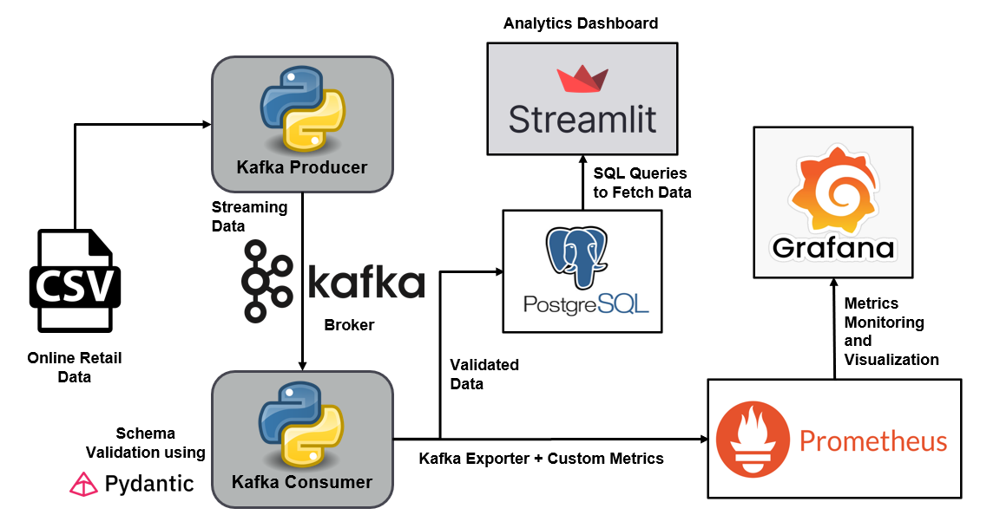

# Real-Time Retail Analytics Pipeline

This project demonstrates a real-time data pipeline and analytics dashboard for an online retail dataset. It simulates streaming transactional data, processes it using open-source tools, and visualizes insights through a live dashboard.

---



## Approach Taken

1. Simulated real-time ingestion of transactions using **Kafka Producer**.
2. Streamed, validated, and cleaned events using a **Kafka Consumer** (Python).
3. Stored curated data in a **partitioned PostgreSQL** table for efficient querying.
4. Built a **live-updating Streamlit dashboard** with transaction insights.
5. Exposed **custom Prometheus metrics** (success, failure, invalid counts) from the consumer.
6. Sent metrics to **Grafana Cloud** for real-time pipeline monitoring and alerting.

---

## Tech Stack Used

- **Ingestion**: Apache Kafka Producer
- **Processing**: Kafka Consumer (Python, psycopg2)
- **Storage**: PostgreSQL
- **Visualization**: Streamlit (with Matplotlib and Seaborn)
- **Monitoring**: Prometheus + Grafana Cloud

---

## 📁 Repository Structure

```
├── Dashboard/                   # Streamlit dashboard app
│   ├── requirements.txt         # Python dependencies for dashboard
│   ├── streamlit_local.py       # Local Streamlit app
│   └── streamlit_app.py         # Streamlit visualization scripts for Streamlit Cloud
│
├── Database/                    # SQL scripts and DB optimizations
│   ├── all_queries.sql          # SQL setup (tables, indexes, partitions)
│   └── optimization.md          # Database optimization notes
│
├── Pipeline/                    # Kafka producer-consumer and ingestion pipeline
│   ├── Deprecated/              # Older or backup scripts (archived)
│   ├── dlq_records.log          # Dead Letter Queue log file
│   ├── kafka_consumer.py        # Kafka consumer with validation, DB inserts, metrics
│   ├── kafka_producer.py        # Kafka producer to simulate streaming
│   ├── online_retail_data.csv   # Sample dataset for simulation
│   └── requirements.txt         # Python dependencies for pipeline
│
├── README.md                    # Project documentation
└── architecture.png             # Pipeline architecture diagram

```

---

###  Setup Documentation: 
https://cyan-braid-e26.notion.site/Real-Time-Retail-Data-Pipeline-1e34070bb67380e6aa31eac5cbe140ac

---

## 🚀 Quick Start - Ingestion Pipeline

```bash
# Go to the Code directory
cd Pipeline

# Install Python dependencies
pip install -r requirements.txt

# Run Kafka Producer
python kafka_producer.py

# Run Kafka Consumer (with Prometheus metrics exposed)
python kafka_consumer.py

```

## 🚀 Quick Start - Streamlit App (Local)

```bash
# Go to the Code directory
cd Dashboard

# Install Python dependencies
pip install -r requirements.txt

# Run Streamlit app locally
streamlit run streamlit_local.py

---
